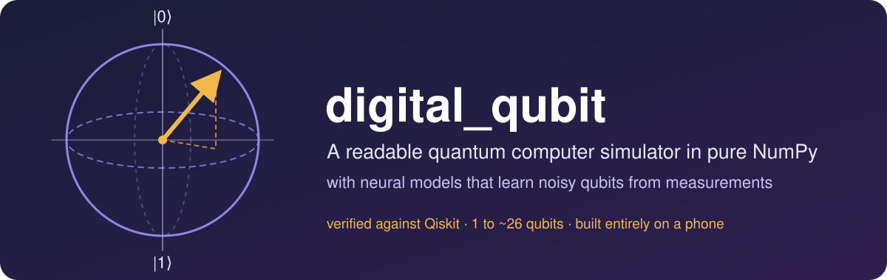
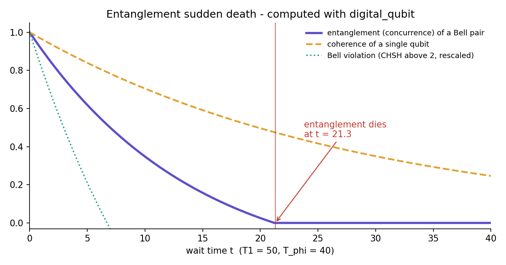

# digital_qubit

A small, readable quantum computer simulator in pure NumPy, plus neural models that learn a
noisy qubit (and a qubit pair) from measurement data alone. Built and tested entirely on a phone
(Android + Google Colab).

**Good for:** learning how a quantum simulator works inside, teaching (interactive Bloch-sphere
circuit app), low-resource setups (only NumPy needed), and benchmarking ML models on a physical
system with exact ground truth.
**Not for:** production quantum work or real hardware - use Qiskit, Cirq, QuTiP or PennyLane.

## Install

    pip install git+https://github.com/akosidave31/digital-qubit

## Quick start

    import digital_qubit as dq

    c = dq.Circuit(2).add("h", 0).add2("cx", 0, 1)    # Bell pair
    print(c.to_text())
    print(c.state().probs())                           # [0.5, 0, 0, 0.5]
    print(c.noisy(20, T1=50, T_phi=40).probs())        # after waiting with noise

*A Bell pair under realistic noise: the pair's entanglement reaches exactly zero at t ≈ 21, while a
single qubit's coherence only fades gradually. Bell-inequality violation disappears even earlier.
Reproduce it with [`examples/02_noise_and_sudden_death.py`](examples/02_noise_and_sudden_death.py).*

More in [`examples/`](examples): Bell pair and CHSH, entanglement sudden death,
learning a hidden qubit, 5-qubit GHZ state.

## What's inside

- **Physics engine:** Bloch sphere, gates (H X Y Z S T Rx Ry Rz P, CNOT, CZ, SWAP), measurement,
  T1/T2 noise, 1 to ~26 qubits (`NQubit`), noisy states (`NDensity`), entanglement measures.
- **Verified** against Qiskit + Qiskit Aer to ~1e-15 (`tests/test_qiskit.py`).
- **Learned models:** bagged NumPy MLP ensembles for one qubit (`build_ensemble`) and a qubit
  pair (`build_ensemble2`), with checkers that compare them to the exact physics
  (`Checker`, `TwoChecker`) and are themselves tested to catch bad models.
- **Apps** (Jupyter/Colab): `digital_qubit.app.launch()` circuit builder,
  `launch_checker(model, device)` model-vs-physics checker.

## Tests

    pip install -e . pytest
    python -m pytest -q                        # fast suite
    python -m pytest -q --runslow              # + model training tests
    pip install qiskit qiskit-aer && python -m pytest -q tests/test_qiskit.py

## v0.6.0 known limitations (two-qubit learned model)

Measured on the shipped default model (release validation run):

| Check | Result |
|---|---|
| Joint outcome odds (500 random experiments) | PASS, 99.2% within TVD 0.03 |
| Bell concurrence at t = 0 (true 1.00) | 0.87 (under-estimated) |
| Bell max concurrence error over time | 0.135 (largest near t = 0) |
| Bell entanglement sudden-death time | 20.5 (true 20.5) |
| Partly entangled pair, max error | 0.045 |
| False entanglement, never-entangled pairs (max, t < 5) | 0.039 |

The physics engine itself has no such limitations (verified against Qiskit to ~1e-15).

## Experiments

Every modeling decision - hypothesis, change, result, and why it was kept or rejected - is in
[EXPERIMENTS.md](EXPERIMENTS.md).

## Contributing

Issues and pull requests are welcome. Please run the test suite before submitting.

## License

MIT - see [LICENSE](LICENSE).
